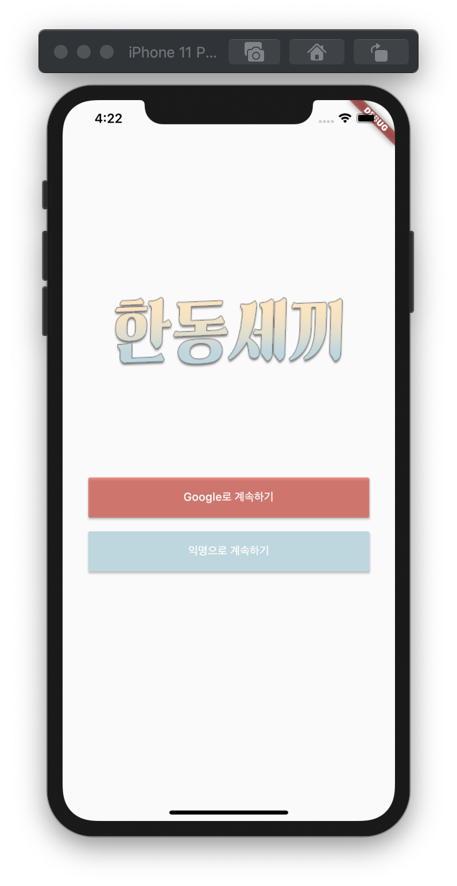

# HandongSeKki

## 완성 화면

사진을 클릭하면 영상을 볼 수 있습니다.

## 주요 기능

- 로그인 및 로그아웃(구글 로그인, 익명 로그인)
- 찜 기능
  - user(uid)에 따른 찜 메뉴 구성은 미완
- 검색 기능
  - 메뉴의 키워드 또는 이름으로 검색 가능
- 댓글 기능(CRUD)
  - 댓글 작성
  - 댓글 불러오기
  - 댓글 수정
    - 이전 댓글이 있는 경우, 사라지고 새로운 댓글 생성.
  - 댓글 삭제
    - 동일 uid만 가능

## 사용한 기술(위젯)

- Stack, ListView, DefaultTabController, TabBarView, TabBar, MaterialPageRoute, InkWell, CircleAvatar, NetworkImage, Divider, IconButton, CarouselSlider, DateTime, ListTile, AlertDialog, FlatButton, GridView, Row, Column, Container, Linkify, SizedBox, Scaffold, SafeArea, ClipRect, BackdropFilter, FocusNode, LinearProgressIndicator

## 사용한 라이브러리

- [carousel_slider](https://pub.dev/packages/carousel_slider): 홈 화면 최상단 메뉴 슬라이드
- [flutter_linkify](https://pub.dev/packages/flutter_linkify): 더 보기 화면 링크 연결
- [url_launcher](https://pub.dev/packages/url_launcher): 더 보기 화면 링크 연결
- [cloud_firestore](https://pub.dev/packages/cloud_firestore): Firebase 연동
- [firebase_auth](https://pub.dev/packages/firebase_auth): Firebase uid 관련
- [google_sign_in](https://pub.dev/packages/google_sign_in): 로그인 화면

## 회고

- 기획의 중요성
  - 기획의 큰 틀만 잡아놓고, 세부적인 기능의 추가 및 삭제를 하다보니 지속적으로 프로젝트에 전반적으로 영향을 미쳤다. 특히 DB쪽. 완벽한 기획이라는 게 있을 수 없지만, 그래도 세세한 부분까지 예상한다면 더 좋은 서비스가 나올 수 있을 것 같다.
- DB의 중요성
  - 설계
    - 댓글에서 불러오고자 하는 내용을 추가하거나 빼다보니, DB를 계속 변경되었다. 프로젝트를 진행하면서 DB 설계가 선행되어야 하는 이유를 몸소 경험할 수 있었다.
  - 메뉴 및 사용자 DB
    - 기존 계획은 유튜브나 네이버웹툰 댓글처럼  각 댓글별 좋아요와 싫어요 기능까지 넣는 것이었다. 시도했는데, 나의 실력 부족으로 기능들을 구현하지 못했다.
    - 프로젝트를 진행하면서 사용자 DB 및 메뉴 DB의 관계성을 느꼈다. 이번 프로젝트는 데이터가 많지 않아 효율성 문제는 생각하지 않았는데, 실제 서비스들은 어떻게 할지 궁금해졌다. 